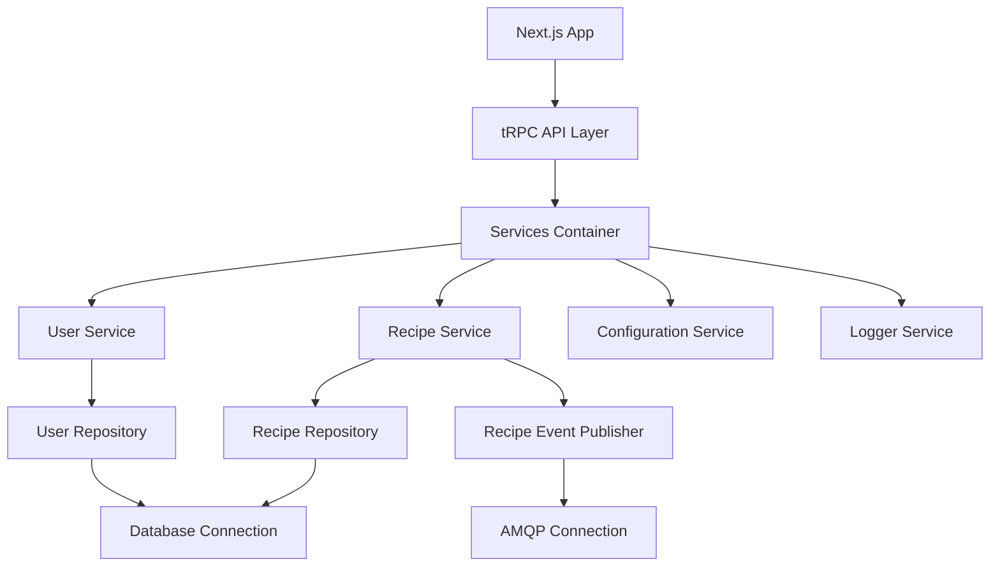
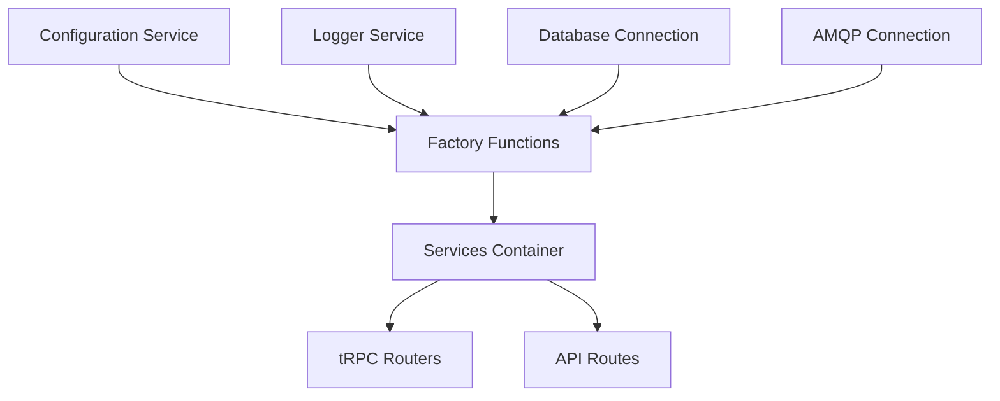

# Next.js Example Application

This project is an example application showcasing some good practices and architectural design principles for a Next.js application. It demonstrates how to structure a scalable, maintainable, and testable codebase using modern development techniques.

## Architectural Principles

### 1. Functional Programming Style
We prioritize functional programming principles throughout the codebase:
- Use of closures over classes
- Ensuring immutability by default
- Favoring pure functions where possible

### 2. Dependency Injection and Inversion of Control
- All external dependencies (database, APIs, environment variables) are accessed through interfaces
- This allows for easy replacement during testing and promotes loose coupling

### 3. Repository Pattern
- Database access is abstracted behind repository interfaces
- Promotes separation of concerns and makes it easier to switch data sources if needed

### 4. Service Pattern
- Business logic is encapsulated in service layers
- Services use repositories and other dependencies injected via factories

### 5. Factory Pattern
- Repositories and services are constructed using factory functions
- These factories take dependencies and return objects with methods that use these dependencies via closures

### 6. Connection Management
- Long-running connections (e.g., database, message broker) are set up before the application runs
- These connections are passed to the repositories and services that require them

### 7. Services Container
- A singleton services container is created at the start of the application
- It holds all instantiated services and repositories
- Created in the NextJS instrumentation hook to ensure it's available before the router

### 8. tRPC Integration
- tRPC routers use the services container for dependency injection
- This allows for easy mocking in tests without relying on module mocking

### 9. Testing Strategy
- Tests use mock/stub implementations of repository and service interfaces
- This allows for isolated testing of each layer without complex setup

## Architecture Diagrams

### Application Structure


### Dependency Injection Flow


### Request Flow
```sequenceDiagram
    participant Client
    participant NextJS
    participant tRPC Router
    participant Service
    participant Repository
    participant Database

    Client->>NextJS: HTTP Request
    NextJS->>tRPC Router: Route Request
    tRPC Router->>Service: Call Service Method
    Service->>Repository: Data Operation
    Repository->>Database: Query
    Database-->>Repository: Result
    Repository-->>Service: Data
    Service-->>tRPC Router: Processed Result
    tRPC Router-->>NextJS: Response
    NextJS-->>Client: HTTP Response
```

## Project Structure

- `src/lib/repositories`: Contains repository interfaces and implementations
- `src/lib/services`: Houses service interfaces and implementations
- `src/lib/connections`: Manages database and message broker connections
- `src/lib/init`: Handles initialization of the services container
- `src/server/api/routers`: Contains tRPC router definitions
- `src/app`: Next.js app router structure

## Getting Started

1. Clone the repository
2. Install dependencies: `npm install` or `yarn install`
3. Set up your environment variables (copy `.env.example` to `.env` and fill in the values)
4. Start the development server: `npm run dev` or `yarn dev`

## Testing

Run the test suite with: `npm test` or `yarn test`

## Contributing

Contributions are welcome! Please read our contributing guidelines for details on our code of conduct and the process for submitting pull requests.

## License

This project is licensed under the MIT License - see the LICENSE file for details.