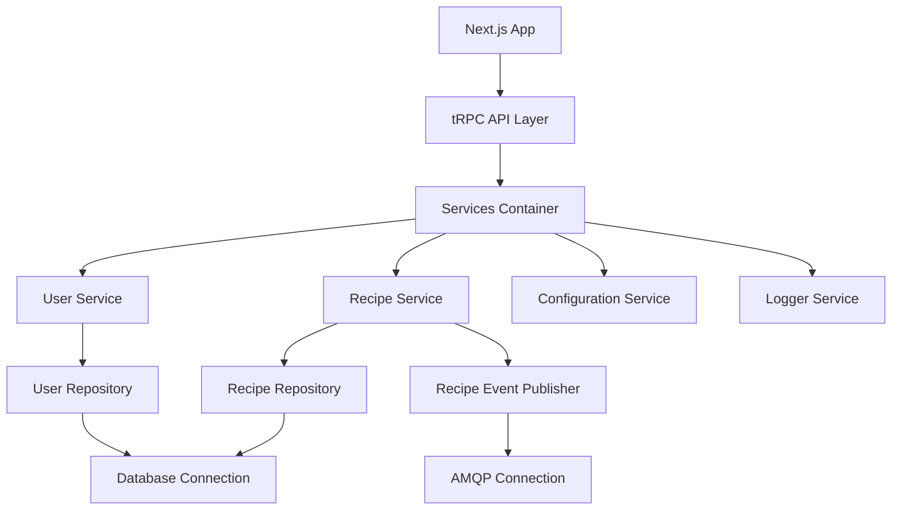
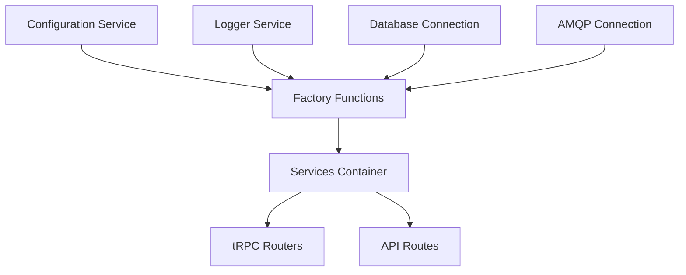
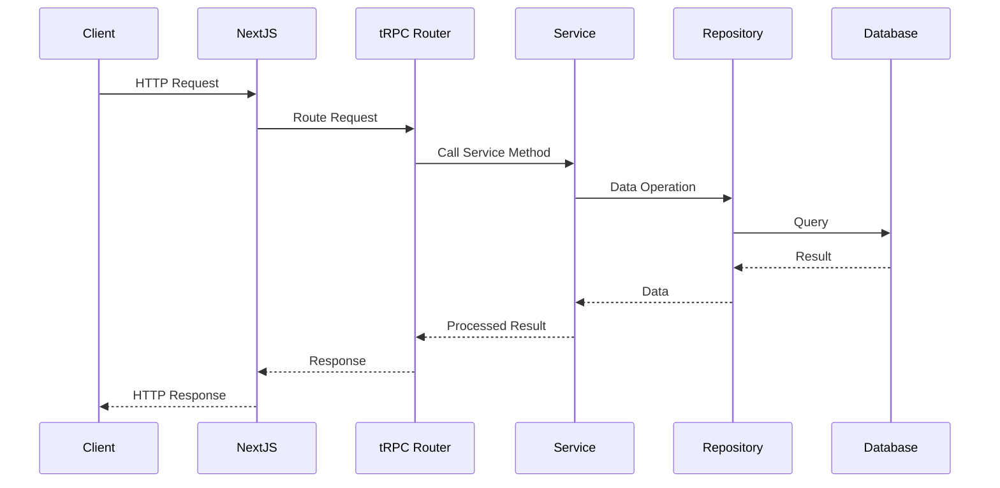

# Next.js Example Application

This project is an example application showcasing some good practices and architectural design principles for a Next.js application. It demonstrates how to structure a scalable, maintainable, and testable codebase using modern development techniques.

It's still a WIP, but will eventually be an app where users can share cooking recipes.
Really the subject matter isn't important, and food is more fun than yet another blog post example.

## Architectural Principles

### 1. Functional Programming Style
We prioritize functional programming principles throughout the codebase:
- Use of closures over classes
- Ensuring immutability by default
- Favoring pure functions where possible

### 2. Dependency Injection and Inversion of Control
- All external dependencies (database, APIs, environment variables) are accessed through interfaces
- This allows for easy replacement during testing and promotes loose coupling

### 3. Repository Pattern
- Database access is abstracted behind repository interfaces
- Promotes separation of concerns and makes it easier to switch data sources if needed

### 4. Service Pattern
- Business logic is encapsulated in service layers
- Services use repositories and other dependencies injected via factories

### 5. Factory Pattern
- Repositories and services are constructed using factory functions
- These factories take dependencies and return objects with methods that use these dependencies via closures

### 6. Connection Management
- Long-running connections (e.g., database, message broker) are set up before the application runs
- These connections are passed to the repositories and services that require them

### 7. Services Container
- A singleton services container is created at the start of the application
- It holds all instantiated services and repositories
- Created in the NextJS instrumentation hook to ensure it's available before the router

### 8. tRPC Integration
- tRPC routers use the services container for dependency injection
- This allows for easy mocking in tests without relying on module mocking

### 9. Testing Strategy
- Tests use mock/stub implementations of repository and service interfaces
- This allows for isolated testing of each layer without complex setup

### 10. Pushing Impurity to the Edges

A key goal of our architecture is to push the impure parts of the application to the edges, primarily during initialization. This approach allows the core of our application to operate on pure functions, bringing several benefits:

- **Predictability**: Pure functions always produce the same output for a given input, making behavior more predictable and easier to reason about.
- **Testability**: Pure functions are easier to test as they don't rely on external state or produce side effects.
- **Concurrency**: Pure functions are inherently thread-safe, which can be beneficial for performance in certain scenarios.
- **Debugging**: When most of your application logic is pure, it's easier to isolate and identify issues.

In practice, this means:

1. We initialize all impure constructs (database connections, external API clients, etc.) in `instrumentation.ts` at application start.
2. These initialized constructs are then injected into our repositories and services.
3. The majority of our application logic, contained in services and repositories, can then operate as pure functions, working only with their inputs and the injected dependencies.
4. Impure operations (like database queries or API calls) are isolated in specific layers (typically repositories), making them easier to manage and test.

This approach allows us to leverage the benefits of functional programming throughout most of our application while still effectively managing necessary side effects and external dependencies.

## Architecture Diagrams

### Application Structure

### Dependency Injection Flow

### Request Flow

## Application Initialization and Testing Strategy

### Application Initialization

We use Next.js's `instrumentation.ts` file to initialize our application's core components:

1. The `instrumentation.ts` file runs before the application starts, allowing us to set up our dependency injection container.
2. In this file, we:
   - Establish database and message broker connections, which exist for the lifetime of the application
   - Create real instances of repositories using these connections
   - Instantiate services with their required dependencies (repositories, loggers, etc.)
   - Populate the services container with these instances

3. The initialized components are stored in a dependency injection container implemented using the singleton pattern. This ensures:
   - A single, consistent instance of each service and repository throughout the application lifecycle
   - Runtimes where we cannot run code beforehand (e.g. an API endpoint or server action) can still access the services container

This approach ensures that:
- All dependencies are properly initialized before the application handles any requests
- The application uses a single, consistent set of service instances throughout its lifecycle
- We have full control over the initialization process, making it easier to add new services or modify existing ones
- The singleton container provides a centralized point of access to all services, simplifying dependency management

### Layered Testing Strategy

Our testing strategy focuses on testing each layer of the application in isolation:

1. Repository Layer Tests:
   - The repository layer is primarily responsible for data access and manipulation, and it therefore does not make sense to mock out the database connection in these tests.
   - We test against a real PostgreSQL database, spun up in a Docker container for each test run.
   - **TODO: add pg-test or testcontainers to the project to make this easier**

2. Service Layer Tests:
   - Use mock repositories to test service logic
   - Focus on business logic and service method behaviors
   - Ensure proper interaction between services and repositories

3. API Layer Tests:
   - Use mock services to test API routes and tRPC procedures
   - Ensure correct request handling, parameter validation, and response formatting
   - Where it makes sense, we can also use msw to mock out external API calls

4. Integration Tests:
   - Test the interaction between multiple layers
   - May use test databases or containerized services for more realistic scenarios

5. End-to-End Tests:
   - Test the entire application stack
   - Use tools like Playwright or Cypress to simulate user interactions
   - **TODO: add playwright to the project to demonstrate this**

This layered approach allows us to:
- Isolate and quickly identify issues in specific parts of the application
- Achieve high test coverage with fast-running unit tests
- Reduce reliance on slow or flaky integration/E2E tests for basic functionality
- Easily mock external dependencies, improving test reliability and speed

By combining this testing strategy with our dependency injection approach, we can easily swap out real implementations for test doubles, ensuring our tests are fast, reliable, and truly unit-focused when needed.

## Project Structure

- `src/lib/repositories`: Contains repository interfaces and implementations
- `src/lib/services`: Houses service interfaces and implementations
- `src/lib/connections`: Manages database and message broker connections
- `src/lib/init`: Handles initialization of the services container
- `src/server/api/routers`: Contains tRPC router definitions
- `src/app`: Next.js app router structure

## Getting Started

1. Clone the repository
2. Install dependencies: `npm install` or `yarn install`
3. Set up your environment variables (copy `.env.example` to `.env` and fill in the values)
4. Start the development server: `npm run dev` or `yarn dev`

## Testing

Run the test suite with: `npm test` or `yarn test`

## Contributing

Contributions are welcome! Please read our contributing guidelines for details on our code of conduct and the process for submitting pull requests.

## License

This project is licensed under the MIT License - see the LICENSE file for details.
